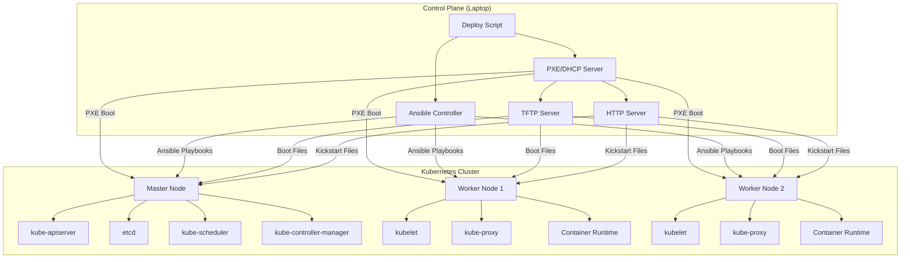
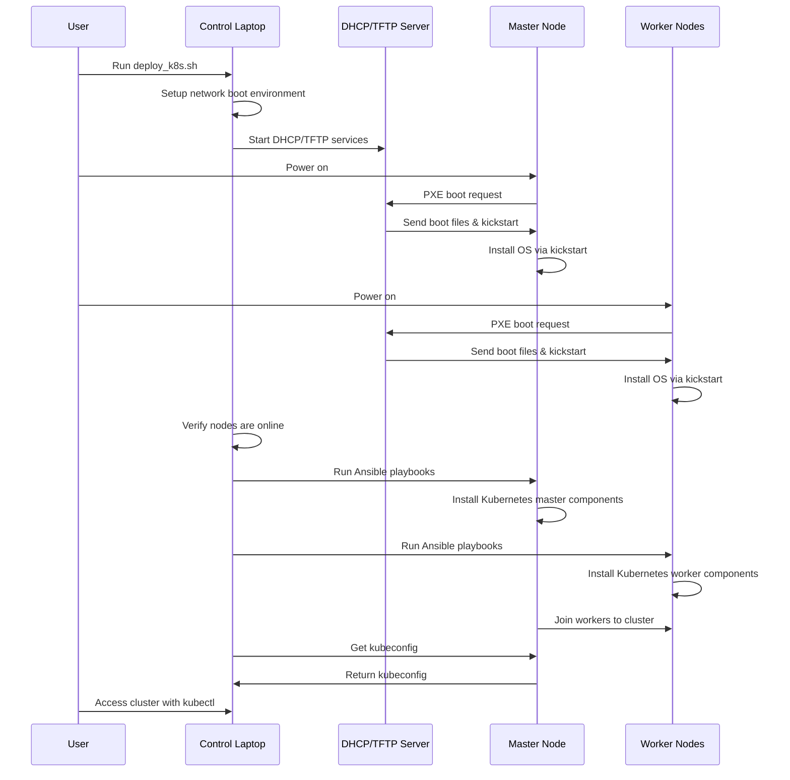

# kube-lab

A project for automating Kubernetes deployment in a homelab environment using network booting and remote orchestration.

## Project Objective

The main goal of this project is to automate the end-to-end process of installing and configuring a Kubernetes cluster in a homelab environment. The automation includes network booting of nodes and complete cluster setup initiated from a control machine (laptop).

## Hardware Configuration

The homelab consists of:
- 3 Mini PCs with Intel N95 processors
- Each node equipped with 16GB RAM
- Each node has 512MB of storage
- Control machine (laptop) for orchestrating the deployment

## Key Features

- Network boot (PXE) capability for initial OS loading
- Automated Kubernetes installation and configuration
- Remote deployment initiated from control machine
- End-to-end automation from bare metal to working Kubernetes cluster

## Architecture Diagram

The following diagram illustrates the architecture of the Kubernetes homelab setup:



## Deployment Flow

The following diagram shows the automated deployment flow:



## Prerequisites

Before starting, ensure you have:

1. A control machine (laptop) running Linux with administrator/sudo access
2. 3 Mini PCs with network boot capability enabled in BIOS
3. All machines connected to the same network
4. The following tools installed on your control machine:
   - Git
   - Ansible
   - SSH client
   - Basic networking tools

## Step-by-Step Setup Guide

### 1. Clone the Repository

```bash
git clone https://github.com/your-username/kube-lab.git
cd kube-lab
```

### 2. Configure the Ansible Inventory

Edit `kube-lab/ansible/inventory/hosts.ini` to match your network configuration:

```ini
# Example configuration - update IP addresses to match your network
[k8s_masters]
master ansible_host=192.168.1.101 ansible_user=ubuntu

[k8s_workers]
worker1 ansible_host=192.168.1.102 ansible_user=ubuntu
worker2 ansible_host=192.168.1.103 ansible_user=ubuntu
```

### 3. Router Configuration for PXE Boot

Since you're using a TP-Link ER605 V2 router as your DHCP server, you'll need to configure it to support PXE booting:

1. Log in to your TP-Link ER605 V2 router's admin interface
2. Navigate to Network → DHCP → DHCP Settings
3. Ensure DHCP Service is enabled
4. Under DHCP Options Configuration, add the following options:
   - Option 66 (TFTP Server): [Your laptop's IP address]
   - Option 67 (Bootfile Name): pxelinux.0
5. Save the configuration

Alternatively, the deployment script offers a "proxy DHCP" mode that doesn't require router configuration but provides only PXE boot information alongside your router's DHCP service.

### 4. Run the Deployment Script

The main deployment script will guide you through the entire process:

```bash
sudo bash kube-lab/scripts/deploy_k8s.sh
```

The deployment process has three stages:

#### Stage 1: Network Boot Setup

- Configures your control machine as a PXE boot server
- Sets up DHCP, TFTP, and HTTP services for network booting
- Prepares Ubuntu installer and kickstart files

#### Stage 2: Node Verification

- Boots mini PCs from the network and installs Ubuntu automatically
- Verifies all nodes are online and accessible via SSH
- Ensures proper configuration for Kubernetes installation

#### Stage 3: Kubernetes Deployment

- Deploys Kubernetes using Ansible
- Configures the master node and worker nodes
- Sets up networking, storage, and basic cluster configuration
- Provides a kubeconfig file for cluster access

### 5. Access Your Kubernetes Cluster

Once the deployment is complete, you can access your Kubernetes cluster from your control machine:

```bash
kubectl get nodes
kubectl get pods --all-namespaces
```

## Detailed Documentation

For more detailed instructions and configuration options:

- Network boot setup: `docs/network-boot-setup.md`
- Kubernetes configuration: Review files in the `configs/kubernetes/` directory
- Ansible roles and playbooks: Explore the `ansible/` directory

## Troubleshooting

If you encounter issues during deployment:

1. Check network connectivity between your control machine and mini PCs
2. Ensure BIOS settings on mini PCs have network boot enabled
3. Verify there are no DHCP conflicts on your network
4. Review logs in the deployment terminal output
5. Check individual service logs:
   - DHCP/TFTP: `sudo journalctl -u dnsmasq -f`
   - Ansible: Check output during deployment

## Future Plans

- Implement automated backup and restore procedures
- Add monitoring and alerting solutions
- Create easy node addition/replacement procedures

## Contributing

Contributions are welcome! Please feel free to submit a Pull Request.

## License

[Add your license information here]